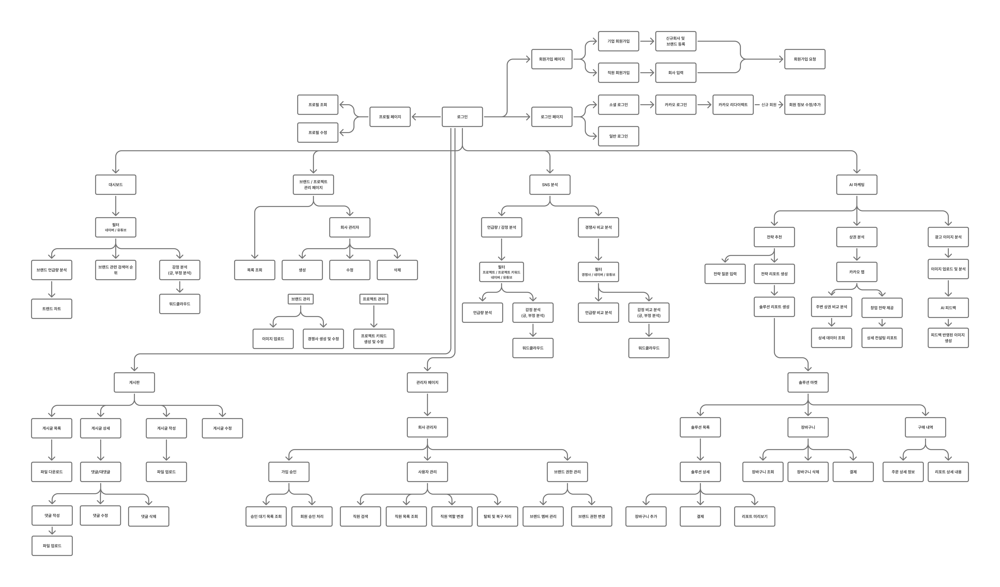
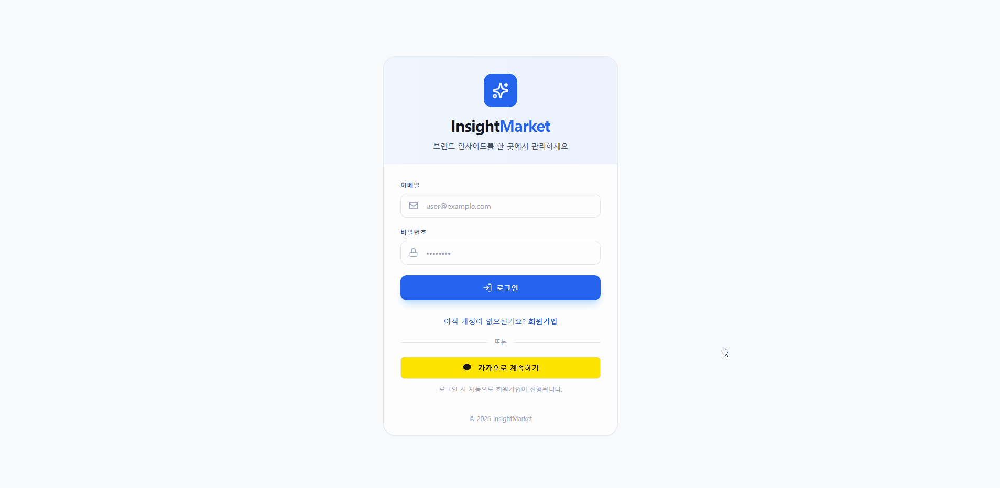
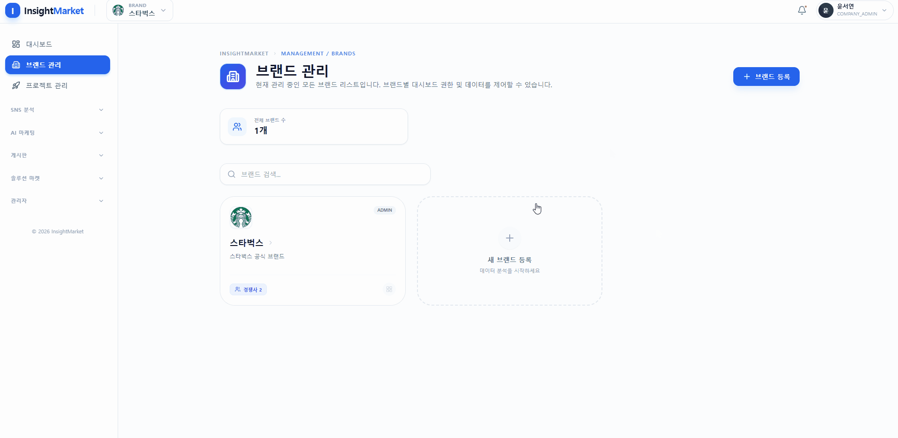
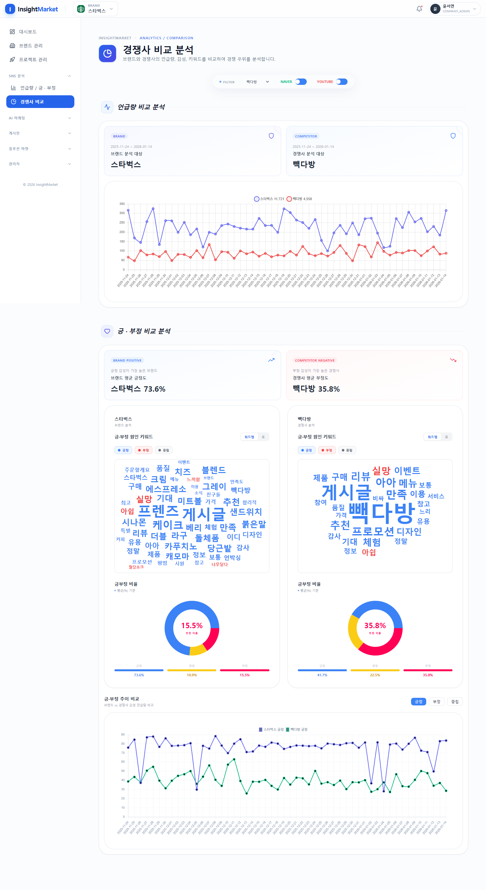

# InsightMarket

## 프로젝트 소개

SNS 데이터 기반 데이터 분석 및 AI 맞춤형 전략 추천 플랫폼

## 개발 기간

25.12.17(수) ~ 26.01.16(금)

## 📑 목차

- [팀원](#팀원)
- [주요 기능](#-주요-기능)
- [사용 스택](#-사용-스택)
- [ERD & 유스케이스](#erd--유스케이스)
- [기능 소개](#기능-소개)
  - [로그인 및 회원가입 (소셜 로그인)](#로그인-및-회원가입-소셜-로그인)
  - [대시보드](#대시보드)
  - [브랜드 및 프로젝트 관리](#브랜드-및-프로젝트-관리)
  - [SNS 분석](#sns-분석)
  - [전략 추천](#전략-추천)
  - [상권 분석](#상권-분석)
  - [광고 이미지 분석](#광고-이미지-분석)
  - [결제 시스템 (포트원) 및 장바구니](#결제-시스템-포트원-및-장바구니)
  - [게시판](#게시판)
  - [관리자 페이지](#관리자-페이지)
  - [반응형 UI](#반응형-ui)

## 팀원

| | | |
|:---:|:---:|:---:|
| <a href="https://github.com/jwantit"><br /><b>김지원</b><br />팀장</a> | <a href="https://github.com/JeonHaSung"><br /><b>전하성</b><br />팀원</a> | <a href="https://github.com/junhwan0427"><br /><b>조준환</b><br />팀원</a> |

---

### 김지원 (팀장)

**Front-end**
- OAuth 2.0 & JWT 기반 인증 UI 및 플로우 설계
- 카카오 소셜 로그인 통합
- RBAC 기반 React Router 접근 제어 구현
- 관리자 전용 대시보드 UI (회원 승인, 권한 관리)
- 브랜드 및 프로젝트 관리 인터페이스 개발
- 감정 분석 결과 시각화 및 비교 대시보드 UI 개발
- 전체 페이지 스타일링 처리

**Back-end**
- JPA 기반 도메인 모델 설계 및 엔티티 구현
- Spring Security + JWT 인증/인가 시스템 설계 및 구현
- Spring Boot 인프라 설정 클래스 구성
- Spring Security Filter Chain 및 CORS 정책 설정
- JPA 기반 권한 관리 시스템 구현 (ADMIN, COMPANY_ADMIN, USER)
- Spring Boot CRUD API 구축 (Member, Brand, Project, Board 등)
- @RestControllerAdvice 기반 전역 예외 처리 구현

**Server AI (Python)**
- FastAPI 기반 데이터 분석 파이프라인 구축
- KoBERT 기반 감정 분석 시스템 통합
- SentenceTransformer(KoE5)를 활용한 데이터 전처리 및 통계 집계
- LLM 프롬프트 최적화 및 텍스트 마이닝 로직 구현

**On-device AI**
- Ollama(qwen, llava) 기반 로컬 LLM/Vision 파이프라인 구축
- KoE5 임베딩을 활용한 온디바이스 벡터화 처리
- 전략 추천을 위한 로컬 AI 엔진 설계

---

### 전하성 (팀원)

**Front-end**
- Redux Toolkit을 활용한 전역 상태 관리
- 장바구니, 상품 목록, 구매 내역 페이지 구현
- PortOne 결제 페이지 통합
- Recharts 및 react-wordcloud를 활용한 데이터 시각화 구현

**Back-end**
- PortOne API(V2) 기반 결제 검증 및 주문 생성 시스템 구현
- JPA 기반 상품/장바구니 CRUD 및 페이징 처리
- QueryDSL을 활용한 구매 내역 조회 및 필터링 구현
- Redis를 활용한 대시보드 캐싱 처리
- 상권 분석용 더미 데이터 처리 및 API 제공

**Server AI (Python)**
- pytrends를 활용한 Google Trends 관련 키워드 수집
- GPT-4o-mini를 활용한 상권 분석 프롬프트 자동화
- FastAPI 기반 상권 컨설팅 응답 API 구축

---

### 조준환 (팀원)

**Front-end**
- 게시판 CRUD UI 구현
- 댓글/대댓글 트리 구조를 위한 재귀 컴포넌트 구성
- 파일 첨부 처리 (FormData, keepFilelds)
- Intersection Observer 기반 공통 무한 스크롤 컴포넌트 구현
- 커스텀 Alert 공통 컴포넌트 및 전역 알림 시스템 구축
- SSE 기반 실시간 트렌드 수신 훅 (useTrendSse) 구현
- 카카오 맵 API를 활용한 위치 선택 및 상권 분석 통합

**Back-end**
- JPA 기반 도메인 모델 설계 및 엔티티 구현
- Spring Boot + JPA 게시판/댓글 CRUD 구현
- @EntityGraph를 활용한 트리 구조 쿼리 최적화
- MultipartFile 기반 파일 업로드/다운로드 API 구현
- Java ImageIO를 활용한 자동 이미지 썸네일 생성 구현
- Spring-Python 서버 간 통신 인프라 구축 (WebClient 기반)
- Redis 기반 트렌드 캐싱 시스템 구축
- SseEmitter 기반 SSE 실시간 스트리밍 시스템 구축

**Server AI (Python)**
- RAG(Retrieval-Augmented Generation) 기반 전략 추천 파이프라인 구축

**On-device AI**
- Qdrant Vector DB를 활용한 전략 템플릿 벡터 검색 시스템 구축

## 🛠️ 주요 기능

- 로그인 및 회원가입 - JWT 인증 및 카카오 소셜 로그인

- 대시보드 - 실시간 통계 및 감정 분석 시각화

- 브랜드 및 프로젝트 관리 - 프로젝트별 키워드 및 데이터 수집 제어

- SNS 분석 - YouTube/Naver 데이터 수집 및 KoBERT 감정 분석

- 전략 추천 - RAG 기반 AI 전략 추천 시스템

- 상권 분석 - 카카오 맵 기반 위치 분석 및 컨설팅 리포트

- 광고 이미지 분석 - LLM 기반 마케팅 이미지 평가

- 결제 시스템 및 장바구니 - 포트원 결제 및 프로젝트별 장바구니

- 게시판 - 대댓글 및 파일 첨부 기능

- 관리자 페이지 - 가입 승인 및 권한 관리

- 반응형 UI 구현 - PC / 태블릿 / 모바일

## 📚 사용 스택

🖥️ **Front-end** : React, Vite, Tailwind CSS, Redux Toolkit, Chart.js

🗄️ **Back-end** : Spring Boot 3.5.9, Java 21, Spring Security, JWT, MariaDB, Redis

🤖 **AI/ML** : Python, FastAPI, PyTorch, Transformers, KoBERT, Sentence Transformers, Qdrant, Ollama, Konlpy, soynlp

🗺️ **API** : 포트원 API, 카카오 맵 API, 카카오 소셜 로그인 API, 네이버 & 유튜브 API

## ERD & 유스케이스

### ERD


### 유스케이스 다이어그램



## 기능 소개

### 로그인 및 회원가입 (소셜 로그인)

- JWT를 이용한 보안 처리 및 Spring Security 활용

- 카카오 소셜 로그인 구현



```java
// 카카오 소셜 로그인 - 이메일 추출 및 회원 생성
public MemberDTO getKakaoMember(String accessToken) {
    String email = getEmailFromKakaoAccessToken(accessToken);
    return memberRepository.findByEmail(email).map(this::entityToDTO)
            .orElseGet(() -> entityToDTO(memberRepository.save(makeSocialMember(email))));
}

// 로그인 성공 시 JWT 토큰 발급
public void onAuthenticationSuccess(HttpServletRequest request, HttpServletResponse response, Authentication authentication) {
    MemberDTO memberDTO = (MemberDTO)authentication.getPrincipal();
    if (!memberDTO.isApproved() && memberDTO.getRoleNames().contains("USER")) {
        throw new AuthenticationServiceException("NOT_APPROVED");
    }
    Map<String, Object> claims = memberDTO.getClaims();
    claims.put("accessToken", JWTUtil.generateToken(claims, 60));
    claims.put("refreshToken", JWTUtil.generateToken(claims, 60*24));
    response.getWriter().println(new Gson().toJson(claims));
}
```

---

### 대시보드

- 실시간 통계 및 분석 결과 표시

- 언급량 및 긍정/부정 감정 분석 시각화 (차트, 그래프)

- 파이썬 스케줄러를 통한 자동 데이터 수집 및 분석

<div style="max-height: 550px; overflow-y: auto; overflow-x: auto; width: 100%;">

</div>

```python
# 파이썬 분석 파이프라인 - KoBERT 감정 분석 및 통계 집계
def run_analysis_pipeline(file_path: str, brand_id: Optional[int] = None) -> Dict:
    preprocessed_data = preprocess_data(parse_raw_data(file_path, brand_id), use_morphology=True)
    tokenizer, model = get_kobert_model()
    analyzed_docs = [{"brand_id": item["brand_id"],
                      "sentiment": map_sentiment_to_spring(predict_sentiment(item.get("text", ""), tokenizer, model)[0]),
                      "stat_date": item.get("stat_date")} for item in preprocessed_data]
    daily_stats = aggregate_keyword_daily_stats(analyzed_docs)
    return {"status": "success", "daily_stats": transform_to_spring_daily_stats(daily_stats),
            "insights": transform_to_spring_insights(generate_insight_results(
                detect_spikes(daily_stats, aggregate_keyword_sentiment_daily_stats(analyzed_docs))))}
```

---

### 브랜드 및 프로젝트 관리

- 브랜드별 프로젝트 생성 및 관리

- 프로젝트별 키워드 및 데이터 수집 제어



---

### SNS 분석

- Python FastAPI를 통한 YouTube 및 Naver 데이터 수집

- KoBERT 모델을 활용한 감정 분석 (PyTorch)

- Python 전처리 파이프라인 (Konlpy, soynlp 활용)

- 경쟁사 비교 분석

<div style="max-height: 550px; overflow-y: auto; overflow-x: auto; width: 100%;">

</div>

```python
# KoBERT 감정 분석 및 YouTube/Naver 데이터 수집
def predict_sentiment(text, tokenizer, model):
    inputs = {k: v.to("cpu") for k, v in tokenizer(text, return_tensors="pt", truncation=True, max_length=128).items()}
    with torch.no_grad():
        probs = torch.softmax(model(**inputs).logits, dim=1)
        score, label_id = torch.max(probs, dim=1)
        predicted_label = LABEL_MAP[label_id.item()]
        # 중립 예측 시 긍정/부정 확률 차이로 재분류
        if predicted_label == "neutral" and probs[0][2] > probs[0][0] + 0.1:
            predicted_label = "positive"
        elif predicted_label == "neutral" and probs[0][0] > probs[0][2] + 0.1:
            predicted_label = "negative"
        return predicted_label, float(score)
```

---

### 전략 추천

- Python FastAPI 기반 RAG 전략 추천 시스템

- Qdrant 벡터 DB를 활용한 유사 전략 템플릿 검색

- Sentence Transformers를 통한 임베딩 생성

- Ollama LLM을 활용한 리포트 생성


```python
# RAG 기반 전략 추천 - Qdrant 벡터 검색 및 Ollama 리포트 생성
def run_strategy_analysis(project_id: int, brand_id: int, brand_name: str, question: str,
                         project_keyword_ids: List[int], embed_model: SentenceTransformer, top_k: int = 3):
    query_text = build_query_from_keyword_stats(
        extract_keyword_stats_from_raw_data(load_and_filter_today_data(brand_id, brand_name, project_keyword_ids)), question)
    # Qdrant 벡터 DB에서 유사 템플릿 검색
    problems = match_strategy_templates(query_text, "cause", qdrant_client, embed_model, "strategy_templates", top_k)
    # 문제점 카테고리 기반 솔루션 검색
    solutions = [match_strategy_templates(query_text, "solution", qdrant_client, embed_model,
        "strategy_templates", 1, p["payload"].get("category"))[0]["payload"]
        for p in problems[:top_k] if p["payload"].get("category")]
    # Ollama LLM을 활용한 리포트 생성
    return {"ok": True, "data": {"solutions": [s.get("title", "") for s in solutions]},
            "report": generate_strategy_report(brand_name, question,
                [p["payload"].get("title", "") for p in problems], [s.get("title", "") for s in solutions],
                ollama_url=settings.ollama_url, ollama_model=settings.ollama_model)}
```

---

### 상권 분석

- 카카오 맵 API를 활용한 위치 기반 상권 분석

- Python FastAPI를 통한 컨설팅 리포트 생성 (Ollama LLM 활용)


```javascript
// 카카오 맵 API를 활용한 위치 선택 및 검색
useEffect(() => {
  window.kakao.maps.load(() => {
    const map = new window.kakao.maps.Map(mapRef.current, {
      center: new window.kakao.maps.LatLng(getCurrentPosition())
```
```python
# 상권 분석 컨설팅 리포트 생성 (OpenAI LLM)
@router.post("/generate-consulting-report")
async def generate_consulting_report(request: Request):
    trace_id = request.headers.get("X-Trace-Id", "json")
    body = await request.json()
    final_prompt = create_consulting_prompt(body.get("BEST"), body.get("WORST"), body.get("REDIUS"))
    generated_consulting_text = await generate_with_openai(
        api_key=settings.openai_api_key, model=settings.openai_model,
        prompt=final_prompt, timeout_sec=settings.openai_timeout_sec, trace_id=trace_id)
    return JSONResponse(content={"consulting": markdown.markdown(generated_consulting_text)}, status_code=200)
```

---

### 광고 이미지 분석

- Python FastAPI를 통한 이미지 분석 서비스

- Ollama/OpenAI LLM을 활용한 이미지 콘텐츠 분석

- 자극성, 가독성, 감성, 전문성, 신뢰도 측정


```python
# Ollama/OpenAI LLM을 활용한 이미지 분석 (Python FastAPI)
def analyze_image_content(base64_image: str, provider: str = "ollama", trace_id: str = "-"):
    Image.open(BytesIO(base64.b64decode(base64_image))).verify()  # 이미지 검증
    # LLM 호출 및 프롬프트 엔지니어링
    result = parse_analysis_response(
        call_ollama_api(build_analysis_prompt(), base64.b64decode(base64_image), trace_id)
        if provider == "ollama" else call_openai_api(build_analysis_prompt(), base64_image, trace_id), trace_id)
    return {"extractedText": result.get("extractedText", ""),
            "metrics": result.get("metrics", {}),  # 자극성, 가독성, 감성, 전문성, 신뢰도
            "pros": result.get("pros", []), "cons": result.get("cons", []),
            "recommendations": result.get("recommendations", "")}
```

---

### 결제 시스템 (포트원) 및 장바구니

- 포트원 API를 통한 결제 구현

- 장바구니 기능


```java
// 주문서 생성 및 포트원 결제 준비
public OrderResponseDTO prepareOrder(MemberDTO member, OrderRequestDTO requestDTO) {
    String merchantUid = "ORD-" + UUID.randomUUID().toString().substring(0, 8);
    Orders orders = paymentRepository.save(Orders.builder().paymentId(merchantUid)
            .projectId(requestDTO.getProjectId()).totalPrice(requestDTO.getSolutionIds().stream()
                    .mapToInt(id -> solutionRepository.findSolutionOfProject(id, requestDTO.getProjectId())
                            .orElseThrow().getPrice()).sum()).build());
    return OrderResponseDTO.builder().orderId(orders.getId())
            .merchantUid(merchantUid).amount(orders.getTotalPrice()).build();
}
```

---

### 게시판

- 게시글 및 댓글 작성

- 대댓글 기능

- 이미지 업로드 및 파일 관리


```java
// 댓글/대댓글 생성 및 파일 첨부
public CommentResponseDTO create(Long brandId, Long boardId, CommentModifyDTO data,
                                 List<MultipartFile> files, Member currentMember) {
    Comment parent = data.getParentCommentId() != null
            ? commentRepository.findByIdAndDeletedAtIsNull(data.getParentCommentId()).orElseThrow() : null;
    if (parent != null && (parent.getParent() != null || !parent.getBoard().getId().equals(boardId))) {
        throw new ApiException(ErrorCode.INVALID_REQUEST);
    }
    Comment saved = commentRepository.save(Comment.builder()
            .board(boardRepository.findByIdAndBrandIdAndDeletedAtIsNull(boardId, brandId).orElseThrow())
            .writer(currentMember).parent(parent).content(data.getContent()).build());
    return CommentResponseDTO.builder().commentId(saved.getId())
            .files(fileService.saveFiles(FileTargetType.COMMENT, saved.getId(), currentMember.getId(), files)).build();
}
```

---

### 관리자 페이지

- 가입 승인 관리

- 사용자 계정 관리

- 브랜드 권한 관리


---

### 반응형 UI

- Tailwind CSS 기반 모바일/태블릿/데스크톱 반응형 웹 디자인

- 브레이크포인트별 레이아웃 최적화 (모바일: 600px 이하, 태블릿: 601px~1440px, PC: 1441px 이상)

- 사이드바 모바일 오버레이 및 그리드 레이아웃 자동 조정

